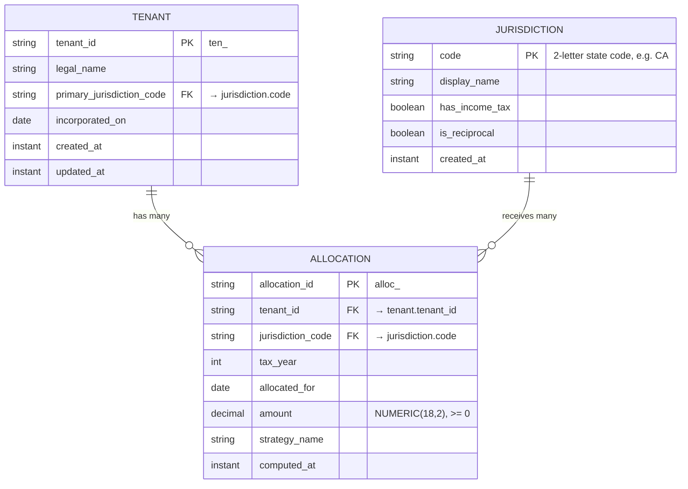

# UptimeCrew Multi-State — Database Schema

This document captures the three tables the Week 1 capstone needs and how they map
back to the `IncomeAllocation` record in Java.

Schema: `multistate`.

## ER Diagram



## Tables

### `multistate.tenant` — primary table

One row per taxpayer entity (the customer of the platform).

| Column | Type | Notes |
| --- | --- | --- |
| `tenant_id` | `VARCHAR(40)` | **PK**, prefixed synthetic key (`ten_<uuid>`) |
| `legal_name` | `VARCHAR(255)` | required |
| `primary_jurisdiction_code` | `CHAR(2)` | FK → `jurisdiction.code`, the tenant's home state |
| `incorporated_on` | `DATE` | `LocalDate` |
| `created_at` | `TIMESTAMPTZ` | `Instant` |
| `updated_at` | `TIMESTAMPTZ` | `Instant` |

- **Primary key:** `tenant_id`
- **Foreign keys:**
  - `primary_jurisdiction_code` → `multistate.jurisdiction(code)` — **many-to-1** (many tenants share a home state)

### `multistate.jurisdiction` — reference table

The set of US states (plus DC) with income-tax flags. Effectively static; loaded by seed.

| Column | Type | Notes |
| --- | --- | --- |
| `code` | `CHAR(2)` | **PK**, e.g. `CA`, `TX`, `NY` |
| `display_name` | `VARCHAR(64)` | e.g. `California` |
| `has_income_tax` | `BOOLEAN` | `false` for TX, FL, WA, NV, SD, WY, AK, TN, NH |
| `is_reciprocal` | `BOOLEAN` | participates in any reciprocity agreement |
| `created_at` | `TIMESTAMPTZ` | `Instant` |

- **Primary key:** `code`
- **Foreign keys:** none

### `multistate.allocation` — computed allocations

One row per `(tenant, jurisdiction, tax_year, allocated_for)` produced by an
`AllocationStrategy` run. This is the persistence form of the Week 1
`IncomeAllocation` record.

| Column | Type | Notes |
| --- | --- | --- |
| `allocation_id` | `VARCHAR(40)` | **PK**, prefixed synthetic key (`alloc_<uuid>`) |
| `tenant_id` | `VARCHAR(40)` | FK → `tenant.tenant_id` |
| `jurisdiction_code` | `CHAR(2)` | FK → `jurisdiction.code` |
| `tax_year` | `SMALLINT` | e.g. `2026` |
| `allocated_for` | `DATE` | pay-period or filing-period date |
| `amount` | `NUMERIC(18,2)` | non-negative; scale 2, `HALF_UP` |
| `strategy_name` | `VARCHAR(64)` | which strategy produced the row (audit) |
| `computed_at` | `TIMESTAMPTZ` | `Instant` |

- **Primary key:** `allocation_id`
- **Unique key:** `(tenant_id, jurisdiction_code, tax_year, allocated_for)` — prevents duplicate allocations
- **Foreign keys:**
  - `tenant_id` → `multistate.tenant(tenant_id)` — **1-to-many** (one tenant, many allocations)
  - `jurisdiction_code` → `multistate.jurisdiction(code)` — **1-to-many** (one jurisdiction, many allocations)

Net cardinality across `tenant` and `jurisdiction` via `allocation` is effectively
**many-to-many**, with `allocation` as the join + value table.

## Mapping back to the Week 1 `IncomeAllocation` record

`src/main/java/com/uptimecrew/multistate/model/IncomeAllocation.java`:

```java
public record IncomeAllocation(
    String id,
    String workerId,
    String jurisdictionCode,
    BigDecimal amount,
    LocalDate allocatedFor
) { ... }
```

| Java field | Type | Column in `multistate.allocation` | Notes |
| --- | --- | --- | --- |
| `id` | `String` | `allocation_id` | same `alloc_<uuid>` shape |
| `workerId` | `String` | `tenant_id` | Week 1 modeled the actor as `workerId`; at the tenant-grain capstone level this maps to `tenant_id`. Worker-grained allocations will be modeled later as a child table of `tenant`. |
| `jurisdictionCode` | `String` | `jurisdiction_code` | 2-letter state code, FK to `jurisdiction` |
| `amount` | `BigDecimal` (scale 2, HALF_UP, ≥ 0) | `amount` | `NUMERIC(18,2)`, DB enforces `>= 0` via CHECK constraint |
| `allocatedFor` | `LocalDate` | `allocated_for` | `DATE` |

Columns on `allocation` that are **not** on the Week 1 record (added for persistence
and audit, not part of the domain value object): `tenant_id` linkage, `tax_year`,
`strategy_name`, `computed_at`.
