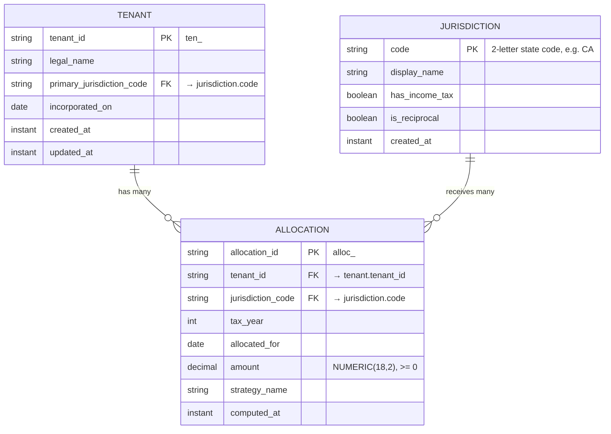

# UptimeCrew Multi-State — Database Schema

This document captures the three tables the Week 1 capstone needs and how they map
back to the `IncomeAllocation` record in Java.

Schema: `multistate`.

## ER Diagram



## Tables

### `multistate.tenant` — primary table

One row per taxpayer entity (the customer of the platform).

| Column | Type | Notes |
| --- | --- | --- |
| `tenant_id` | `VARCHAR(40)` | **PK**, prefixed synthetic key (`ten_<uuid>`) |
| `legal_name` | `VARCHAR(255)` | required |
| `primary_jurisdiction_code` | `CHAR(2)` | FK → `jurisdiction.code`, the tenant's home state |
| `incorporated_on` | `DATE` | `LocalDate` |
| `created_at` | `TIMESTAMPTZ` | `Instant` |
| `updated_at` | `TIMESTAMPTZ` | `Instant` |

- **Primary key:** `tenant_id`
- **Foreign keys:**
  - `primary_jurisdiction_code` → `multistate.jurisdiction(code)` — **many-to-1** (many tenants share a home state)

### `multistate.jurisdiction` — reference table

The set of US states (plus DC) with income-tax flags. Effectively static; loaded by seed.

| Column | Type | Notes |
| --- | --- | --- |
| `code` | `CHAR(2)` | **PK**, e.g. `CA`, `TX`, `NY` |
| `display_name` | `VARCHAR(64)` | e.g. `California` |
| `has_income_tax` | `BOOLEAN` | `false` for TX, FL, WA, NV, SD, WY, AK, TN, NH |
| `is_reciprocal` | `BOOLEAN` | participates in any reciprocity agreement |
| `created_at` | `TIMESTAMPTZ` | `Instant` |

- **Primary key:** `code`
- **Foreign keys:** none

### `multistate.allocation` — computed allocations

One row per `(tenant, jurisdiction, tax_year, allocated_for)` produced by an
`AllocationStrategy` run. This is the persistence form of the Week 1
`IncomeAllocation` record.

| Column | Type | Notes |
| --- | --- | --- |
| `allocation_id` | `VARCHAR(40)` | **PK**, prefixed synthetic key (`alloc_<uuid>`) |
| `tenant_id` | `VARCHAR(40)` | FK → `tenant.tenant_id` |
| `jurisdiction_code` | `CHAR(2)` | FK → `jurisdiction.code` |
| `tax_year` | `SMALLINT` | e.g. `2026` |
| `allocated_for` | `DATE` | pay-period or filing-period date |
| `amount` | `NUMERIC(18,2)` | non-negative; scale 2, `HALF_UP` |
| `strategy_name` | `VARCHAR(64)` | which strategy produced the row (audit) |
| `computed_at` | `TIMESTAMPTZ` | `Instant` |

- **Primary key:** `allocation_id`
- **Unique key:** `(tenant_id, jurisdiction_code, tax_year, allocated_for)` — prevents duplicate allocations
- **Foreign keys:**
  - `tenant_id` → `multistate.tenant(tenant_id)` — **1-to-many** (one tenant, many allocations)
  - `jurisdiction_code` → `multistate.jurisdiction(code)` — **1-to-many** (one jurisdiction, many allocations)

Net cardinality across `tenant` and `jurisdiction` via `allocation` is effectively
**many-to-many**, with `allocation` as the join + value table.

## Mapping back to the Week 1 `IncomeAllocation` record

`src/main/java/com/uptimecrew/multistate/model/IncomeAllocation.java`:

```java
public record IncomeAllocation(
    String id,
    String workerId,
    String jurisdictionCode,
    BigDecimal amount,
    LocalDate allocatedFor
) { ... }
```

| Java field | Type | Column in `multistate.allocation` | Notes |
| --- | --- | --- | --- |
| `id` | `String` | `allocation_id` | same `alloc_<uuid>` shape |
| `workerId` | `String` | `tenant_id` | Week 1 modeled the actor as `workerId`; at the tenant-grain capstone level this maps to `tenant_id`. Worker-grained allocations will be modeled later as a child table of `tenant`. |
| `jurisdictionCode` | `String` | `jurisdiction_code` | 2-letter state code, FK to `jurisdiction` |
| `amount` | `BigDecimal` (scale 2, HALF_UP, ≥ 0) | `amount` | `NUMERIC(18,2)`, DB enforces `>= 0` via CHECK constraint |
| `allocatedFor` | `LocalDate` | `allocated_for` | `DATE` |

Columns on `allocation` that are **not** on the Week 1 record (added for persistence
and audit, not part of the domain value object): `tenant_id` linkage, `tax_year`,
`strategy_name`, `computed_at`.

## Schema decisions

### `multistate.tenant`
Models the taxpayer entity that Week 1 only had implicitly — the `workerId` in
`IncomeAllocation` was really standing in for "the actor whose income is being
allocated." Invariants are enforced by: `PRIMARY KEY (id)` for identity, a
`CHECK (length(trim(legal_name)) > 0)` so blank names can't reach the filing
pipeline, a `CHECK status IN ('ACTIVE','SUSPENDED','CLOSED')` enum-as-check for
lifecycle stage, and `CHECK (updated_at >= created_at)` so audit order can't go
backwards. The FK `primary_jurisdiction_code → jurisdiction(code)` uses
`ON DELETE RESTRICT` — jurisdictions are reference data, and silently
nulling/cascading a tenant's home state would corrupt their compliance posture.

### `multistate.jurisdiction`
Models the "which state" dimension that the Week 1 `jurisdictionCode` string
referred to, lifted into a real reference table so `has_income_tax` and
`is_reciprocal` flags live in one place. Invariants: `PRIMARY KEY (code)`,
`UNIQUE (display_name)` so two rows can't both claim "California", a regex
`CHECK (code ~ '^[A-Z]{2}$')` to keep bad codes (`"Cal"`, `"ca"`) out, and
`CHECK (length(trim(display_name)) > 0)`. It has no outbound FKs — it is the
referenced side; both `tenant` and `allocation` point at it with
`ON DELETE RESTRICT` so a state row can never be deleted while anything still
depends on it.

### `multistate.allocation`
The direct persistence form of the Week 1 `IncomeAllocation` record — one row
per `(tenant, jurisdiction, tax_year, allocated_for)` produced by an
`AllocationStrategy`. Invariants: `PRIMARY KEY (id)` for surrogate identity,
`UNIQUE (tenant_id, jurisdiction_code, tax_year, allocated_for)` as the
natural key that prevents a strategy re-run from inserting duplicates,
`CHECK (amount >= 0)` mirroring the record's non-negative rule into the DB,
`CHECK (tax_year BETWEEN 1900 AND 2100)`, and a `strategy_name` enum-as-check
for audit. The FK to `tenant` is `ON DELETE CASCADE` (allocations are strict
children — if the tenant is gone, their allocations should go too); the FK to
`jurisdiction` is `ON DELETE RESTRICT` for the same reference-data reason as
above.

## Local run

From a clean Postgres on `localhost` with a database named `multistate` and a
user named `multistate`:

```bash
# 1. Create the database (one-time):
psql -h localhost -U postgres -c 'CREATE DATABASE multistate OWNER multistate;'

# 2. Apply the schema:
psql -h localhost -U multistate -d multistate -f db/V1__schema.sql

# 3. Load the seed data (also runs the intentional-failure test at the bottom):
psql -h localhost -U multistate -d multistate -f db/V2__seed.sql

# 4. Run the verification queries:
psql -h localhost -U multistate -d multistate -f db/verify.sql
```

To start fresh, drop and recreate the schema, then re-run from step 2:

```bash
psql -h localhost -U multistate -d multistate \
     -c 'DROP SCHEMA IF EXISTS multistate CASCADE;'
```

## Trade-offs

**Surrogate id + UNIQUE natural key on `allocation`, rather than a composite PK
on `(tenant_id, jurisdiction_code, tax_year, allocated_for)`.** A composite PK
would have expressed the uniqueness rule for free, but it forces every future
child table (e.g. a per-line breakdown, an audit-log entry) to carry the same
four columns as its FK — which is verbose and brittle if the natural key ever
needs a fifth dimension (say, a quarter). A short `alloc-<...>` TEXT id keeps
FKs one column wide; the same invariant is still enforced by a UNIQUE
constraint, so we get the protection without the propagation cost.

**`TEXT + CHECK` for `tenant.status` and `allocation.strategy_name` rather than
a Postgres native `ENUM`.** Native enums are slightly smaller on disk and
slightly faster to compare, but adding a new value requires
`ALTER TYPE … ADD VALUE` which can't run inside a transactional migration in
older Postgres and is hard to roll back. With `TEXT + CHECK`, adding a new
strategy is a one-line `ALTER TABLE … DROP CONSTRAINT … ADD CONSTRAINT …` that
runs transactionally; the small storage/perf cost is worth the migration
ergonomics for a domain where the value set is expected to grow.
